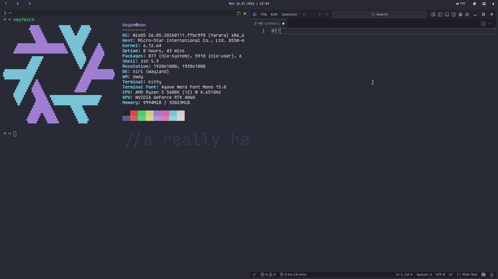
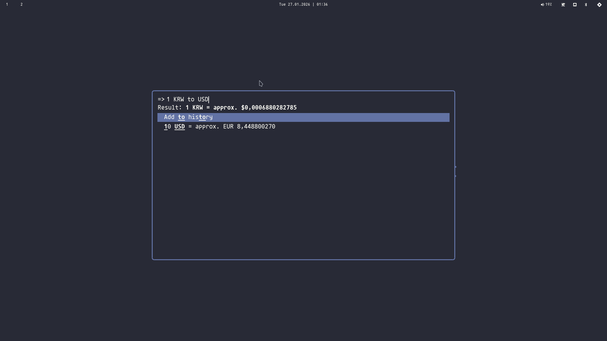

## I have now switched to NixOS!

Running Niri!

## Things to change
- Change the `users.users.boyan` to your username in `nixos/configuration.nix`
- Change the hostnames in `nixos/configuration.nix`, `nixos/hosts/` if needed (eon is my desktop, so nvidia drivers, while peon is my laptop, so intel drivers)
- The git identity in `nixos/configuration.nix`

## To install
Add the home-manager module to ~/.config/home-manager.

Add the nixos module to /etc/nixos/.
Then run `nixos-rebuild switch`.

Oneliner:
```bash
git clone https://github.com/confestim/dotfiles.git ~/dotfiles && ln -s ~/dotfiles/nixos/configuration.nix /etc/nixos/configuration.nix && ln -s ~/dotfiles/home/home.nix ~/.config/home-manager/home.nix && sudo nixos-rebuild switch
```

## Screenshots

